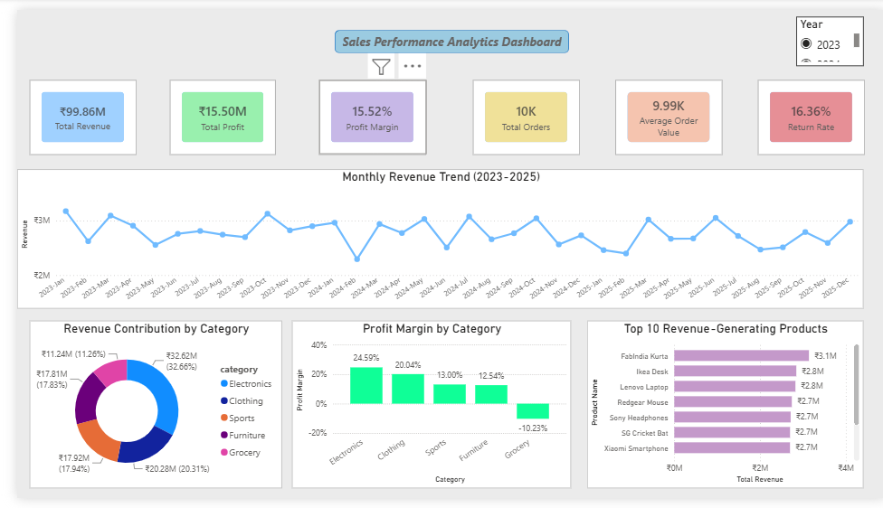
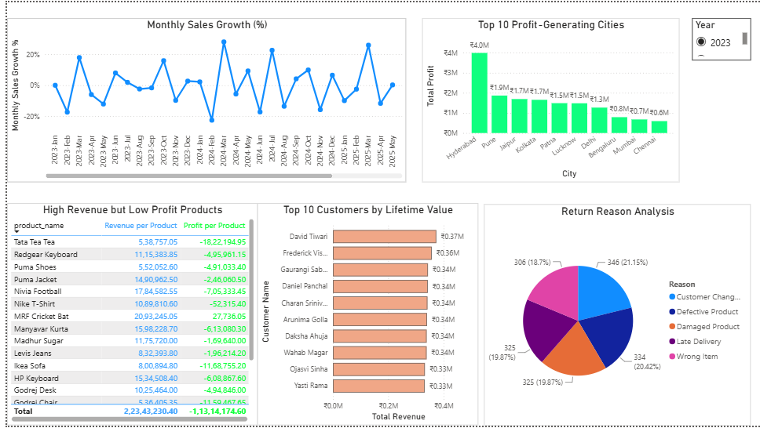
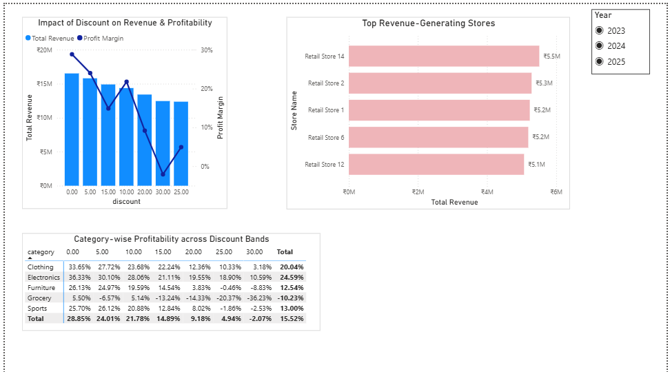

# 📊 RetailPulse AI – Executive Sales Intelligence Platform

An end-to-end Retail Sales Analytics project built using **SQL, Python, Power BI, and Generative AI** to transform raw retail transaction data into executive-level business insights.

The project combines data engineering, business analytics, interactive dashboards, and AI-powered report generation to support strategic decision-making.

---

## 🚀 Project Overview

This project analyzes **10,000+ retail transactions** across multiple stores to answer critical business questions related to:

- Revenue Growth
- Profitability
- Product Performance
- Customer Behavior
- Store Performance
- Return Analysis
- Discount Effectiveness

The platform automatically generates an **AI-powered Executive Business Report** based on calculated KPIs.

---

## 🛠 Tech Stack

- Python
- SQL (MySQL)
- Power BI
- Pandas
- Google Gemini API
- ReportLab
- VS Code

---

## 📂 Project Structure

```text
Sales-Performance-Analytics/
│
├── data/
├── powerbi/
│   └── Sales Performance Analytics.pbix
│
├── python/
│   ├── kpi_generator.py
│   ├── executive_ai.py
│   └── requirements.txt
│
├── sql/
│   └── business_queries.sql
│
├── screenshots/
│
├── README.md
└── Executive_Report.pdf
```

---

## 📈 Dashboard Overview

### Executive Dashboard

- Revenue
- Profit
- Profit Margin
- Orders
- Average Order Value
- Return Rate
- Monthly Revenue Trend
- Revenue by Category
- Profit Margin by Category
- Top Revenue Products

### Business Insights

- Monthly Sales Growth
- Top Customers
- High Revenue–Low Profit Products
- Top Profit Cities
- Return Analysis
- Highest Revenue Month
- Revenue vs Profit by Discount

### Strategic Performance & Optimization

- Category Profit Margin
- Discount Effectiveness
- Store Performance Benchmark

---

## 🤖 AI-Powered Executive Reporting

The platform automatically:

- Reads business KPIs generated using Python
- Sends KPI summaries to Google Gemini
- Produces an executive-ready business report
- Generates strategic recommendations for management

---

## 📸 Dashboard Screenshots

## 📸 Dashboard Preview

### Executive Dashboard



---

### Business Insights



---

### Strategic Performance & Optimization



## 📄 Sample Executive Report

[📄 View Executive Report](Executive_Report.pdf)
---

## ⭐ Key Business Insights

- Identified top-performing products and customers
- Benchmarked high-performing stores
- Evaluated discount effectiveness on profitability
- Analyzed product return trends
- Generated AI-driven strategic recommendations

---

## 👨‍💻 Author

Apoorva
Civil Engineering | Delhi Technological University
Aspiring Business Analyst | Data Analyst
